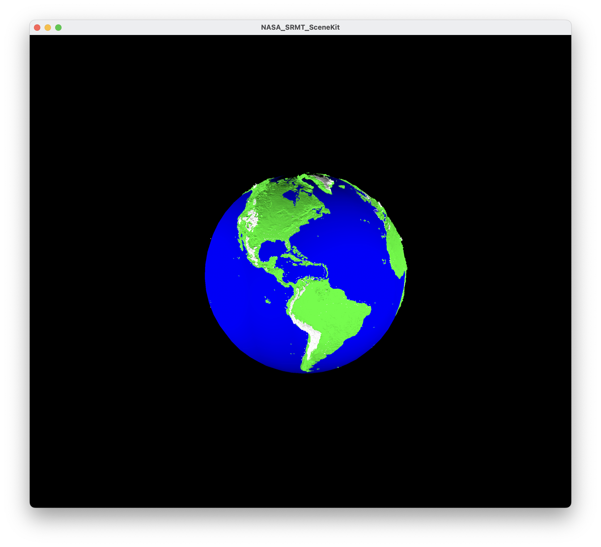
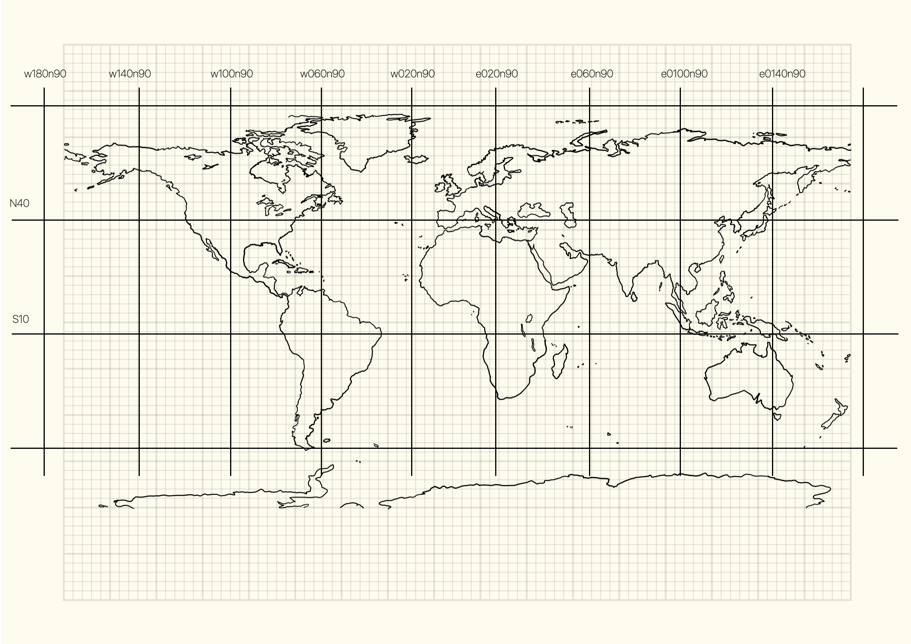

# NASA-SRTM

Reading NASA SRTM files and representing them with Apple Scenekit

I have always been a fan of the Space Shuttle missions and fascinated by the Shuttle Radar Topography Mission (SRTM)

https://www2.jpl.nasa.gov/srtm/

I will try to gather and explain some of the code that I have produced to represent the data from those missions. 

It still blows my mind that one can have access to land elevation data for almost all of the Earth and represent that information in 3D on a mobile phone.

Following is a sample image.



Data is available in different resolutions. Below is a map representation of the different tiles for the 30 arc second file format.

30 arc second files represent land elevation for areas aproximately 1 km.



30 arc second means we should have 2 samples per minute = 120 samples per degree

So, for example, from w060n90 to w020n90 we should have 40 degrees * 120 samples = 4800 samples.
From w020n90 to w020n40 we should have 50 degrees * 120 samples = 6000 samples.

Total number of samples = 3600 * 6000 = 28 800 000 @ 2 bytes per sample => 57 600 000

The list below shows the files that can be downloaded 

```
-rwxrwxrwx@  1 pfernandes  staff  57600000 May  7  2021 E020N40.DEM
-rw-r--r--@  1 pfernandes  staff  57600000 Feb  2  2006 E020N90.DEM
-rwxrwxrwx@  1 pfernandes  staff  57600000 Feb  2  2006 E020S10.DEM

-rwxrwxrwx@  1 pfernandes  staff  57600000 May  7  2021 E060N40.DEM
-rw-r--r--@  1 pfernandes  staff  57600000 Feb  2  2006 E060N90.DEM
-rw-r--r--@  1 pfernandes  staff  57600000 Feb  2  2006 E060S10.DEM

-rw-r--r--@  1 pfernandes  staff  57600000 Feb  2  2006 E100N40.DEM
-rw-r--r--@  1 pfernandes  staff  57600000 Feb  2  2006 E100N90.DEM
-rw-r--r--@  1 pfernandes  staff  57600000 Feb  2  2006 E100S10.DEM

-rw-r--r--@  1 pfernandes  staff  57600000 Feb  2  2006 E140N40.DEM
-rw-r--r--@  1 pfernandes  staff  57600000 Feb  2  2006 E140N90.DEM
-rw-r--r--@  1 pfernandes  staff  57600000 Feb  2  2006 E140S10.DEM

-rw-r--r--@  1 pfernandes  staff  57600000 Feb  2  2006 W020N40.DEM
-rw-r--r--@  1 pfernandes  staff  57600000 Feb  2  2006 W020N90.DEM
-rw-r--r--@  1 pfernandes  staff  57600000 Feb  2  2006 W020S10.DEM

-rw-r--r--@  1 pfernandes  staff  57600000 Feb  2  2006 W060N40.DEM
-rw-r--r--@  1 pfernandes  staff  57600000 Feb  2  2006 W060N90.DEM
-rw-r--r--@  1 pfernandes  staff  57600000 Feb  2  2006 W060S10.DEM

-rw-r--r--@  1 pfernandes  staff  57600000 Feb  2  2006 W100N40.DEM
-rw-r--r--@  1 pfernandes  staff  57600000 Feb  2  2006 W100N90.DEM
-rwxrwxrwx@  1 pfernandes  staff  57600000 Feb  2  2006 W100S10.DEM

-rw-r--r--@  1 pfernandes  staff  57600000 Feb  2  2006 W140N40_.DEM
-rw-r--r--@  1 pfernandes  staff  57600000 Feb  2  2006 W140N90.DEM
-rw-r--r--@  1 pfernandes  staff  57600000 Feb  2  2006 W180N90.DEM
      
